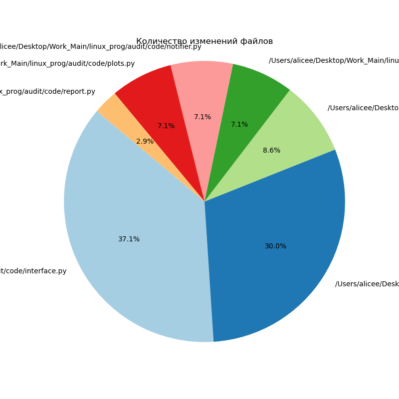
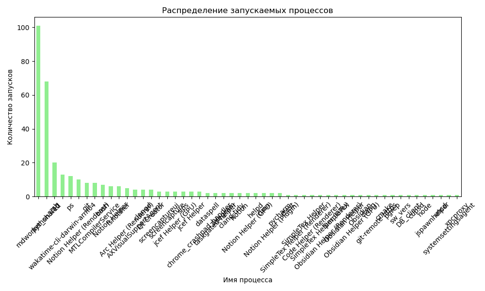
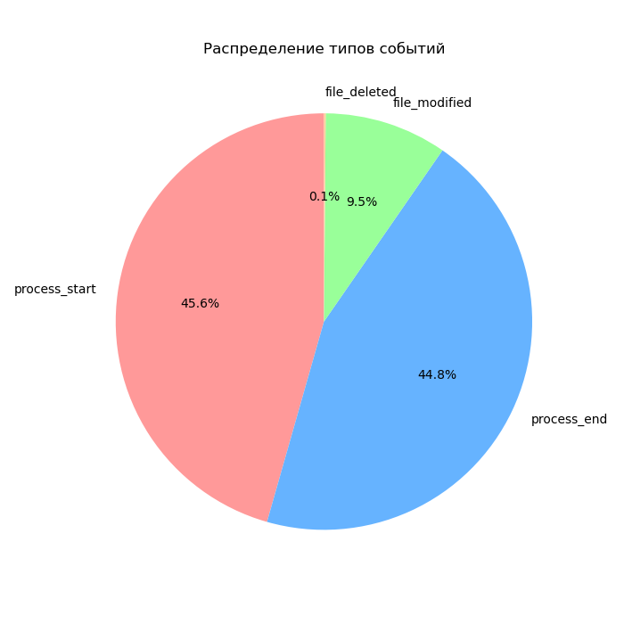

# Отчёт по логам событий

Дата генерации: 2024-12-20 17:22:10

## Общее количество событий: 737

## Распределение событий по типам:
- process_start: 336
- process_end: 330
- file_modified: 70
- file_deleted: 1

## Топ изменяемых файлов:
- /Users/alicee/Desktop/Work_Main/linux_prog/audit/code/interface.py: 26
- /Users/alicee/Desktop/Work_Main/linux_prog/audit/code/test.sh: 21
- /Users/alicee/Desktop/Work_Main/linux_prog/audit/code/event_log.json: 6
- /Users/alicee/Desktop/Work_Main/linux_prog/audit/code/loggerr.py: 5
- /Users/alicee/Desktop/Work_Main/linux_prog/audit/code/notifier.py: 5

## Топ запускаемых процессов:
- mdworker_shared: 101
- python3.12: 68
- zsh: 20
- wakatime-cli-darwin-arm64: 13
- ps: 12

## Топ завершённых процессов:
- Unknown: 330

## Графики:

